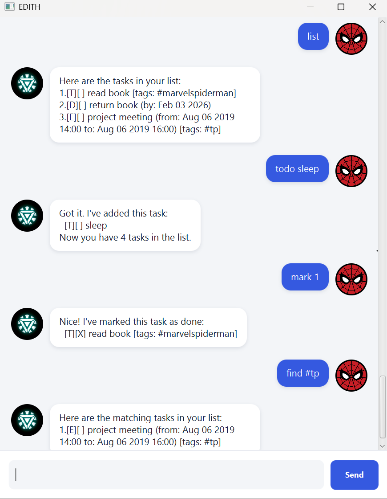

# Edith User Guide

Edith is a task chatbot. Tell it what you need to do, give tasks dates or tags, and find them again later. Edith saves your changes automatically.



- [Quick start](#quick-start)
- [Features](#features)
- [Saving and troubleshooting](#saving-and-troubleshooting)
- [Command summary](#command-summary)

## Quick start

1. Make sure you have **Java 25** installed. Check by running `java -version` in a terminal.
2. [Download or clone this project](https://github.com/PhuXien/ip), then open a terminal in its folder.
3. Build the runnable JAR with `gradlew.bat shadowJar` on Windows or `./gradlew shadowJar` on macOS or Linux. You will find `edith.jar` in `build/libs`.
4. Copy `edith.jar` into an empty folder. Edith saves tasks in a `data` folder inside the folder you start it from. Open a terminal there and run:

   ```text
   java -jar edith.jar
   ```

   The **EDITH** chat window opens and greets you.
5. Type a command in the box at the bottom and press **Enter**, or click **Send**. Try these to get started:
   - `todo read book` adds a task.
   - `list` shows every task.
   - `mark 1` marks your first task as done.
   - `bye` ends the chat.

## Features

In the formats below, replace `UPPER_CASE` words with your own text. Square brackets mean optional input; do not type the brackets. `NUMBER` is the task's position in the full `list`, starting at 1.

Dates use `yyyy-MM-dd`, such as `2026-09-20`. Add an optional 24-hour time in `HHmm` format, such as `2026-09-20 1800`.

### Adding a todo: `todo`

Add a task without a date. Format: `todo DESCRIPTION [/tags #TAG...]`

Example: `todo read book /tags #fun`

Edith adds an unfinished task such as `[T][ ] read book [tags: #fun]`.

### Adding a deadline: `deadline`

Add a task due on a date, optionally at a time. Format: `deadline DESCRIPTION /by yyyy-MM-dd [HHmm] [/tags #TAG...]`

Example: `deadline submit report /by 2026-09-20 1800 /tags #school`

### Adding an event: `event`

Add an event with a start and end. Format: `event DESCRIPTION /from yyyy-MM-dd [HHmm] /to yyyy-MM-dd [HHmm] [/tags #TAG...]`

Example: `event workshop /from 2026-09-21 0900 /to 2026-09-21 1100`

The end must be later than the start.

### Listing tasks: `list`

Type `list` to see every task in the order you added it. `[T]`, `[D]`, and `[E]` mean todo, deadline, and event. `[ ]` means unfinished; `[X]` means done.

### Finding tasks: `find`

Format: `find KEYWORD`

`find report` searches descriptions and tags for that text, ignoring case. `find #school` searches for the **exact tag** `#school`; it does not match `#schoolwork` or a description mentioning `#school`.

Search results are numbered from 1 again. To change a task you found, use its number from the full `list`, not its number in the search results.

### Marking and unmarking tasks: `mark`, `unmark`

Use `mark NUMBER` to finish a task or `unmark NUMBER` to make it unfinished again. For example, `mark 2` changes task 2's status to `[X]`.

### Deleting a task: `delete`

Use `delete NUMBER` to remove a task. For example, `delete 2` removes task 2; later tasks move up in the list.

### Adding and removing tags: `tag`, `untag`

Put `/tags` followed by one or more tags **at the end** of a new `todo`, `deadline`, or `event` command. For an existing task, use `tag NUMBER #TAG [#TAG ...]` or `untag NUMBER #TAG [#TAG ...]`.

For example, `tag 2 #urgent #school` adds two tags to task 2; `untag 2 #urgent` removes one. Tags start with `#` and contain only letters, digits, underscores, or hyphens. Tag matching ignores case, so `#School` and `#school` are the same tag.

### Ending the chat: `bye`

Type `bye` to end the session. In the chat window, the input is disabled after Edith says goodbye.

## Saving and troubleshooting

Edith saves each change in `data/edith.txt`, relative to the directory from which you start it. Start Edith from the same directory to load those tasks again. There is no save command.

If Edith cannot load the file, it tells you and prevents further changes so the file is not overwritten. Fix the file before using Edith again. Invalid commands and task numbers also produce an error message; your list is left unchanged.

## Command summary

| Action | Command | Example |
| --- | --- | --- |
| Add todo | `todo DESCRIPTION [/tags #TAG...]` | `todo read book` |
| Add deadline | `deadline DESCRIPTION /by yyyy-MM-dd [HHmm] [/tags #TAG...]` | `deadline return book /by 2026-09-20` |
| Add event | `event DESCRIPTION /from yyyy-MM-dd [HHmm] /to yyyy-MM-dd [HHmm] [/tags #TAG...]` | `event meeting /from 2026-09-21 0900 /to 2026-09-21 1000` |
| List | `list` | `list` |
| Find | `find KEYWORD` | `find #school` |
| Mark / unmark | `mark NUMBER` / `unmark NUMBER` | `mark 2` |
| Delete | `delete NUMBER` | `delete 2` |
| Tag / untag | `tag NUMBER #TAG [#TAG ...]` / `untag NUMBER #TAG [#TAG ...]` | `tag 2 #urgent` |
| End chat | `bye` | `bye` |
